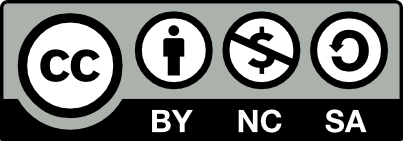

```{r setup, include=FALSE}
htmltools::tagList(rmarkdown::html_dependency_font_awesome())
```

<i class="fa fa-file"></i>

This website assembles the content presented by the Pacific Community in two introductory R workshops presented to fisheries officers from countries across the Pacific.

- TVM Auckland (2016), funded by Te Vaka Moana and in collaboration with NIWA 
- PNA Koror (2017), funded by PNA with generous support from the Palau Bureau of Marine Resources


For more info, contact Laura Tremblay-Boyer or Stephen Brouwer at the Pacific Community.

Feel free to modify and share this content, but please do not use for commercial purposes.

<p align='left' width="50%" height="50%"></p>
