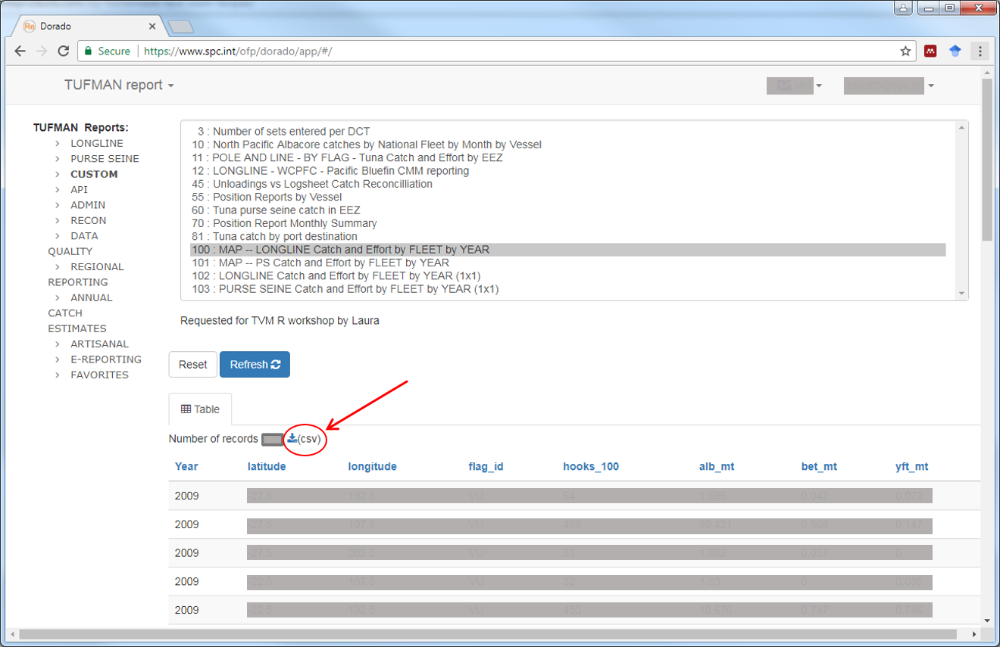

```{r setup, include=FALSE}
knitr::opts_chunk$set(echo = TRUE, eval=FALSE, cache=TRUE)
```

# Get the .csv from Dorado

To get the Dorado report in a .csv, navigate to the report's page, define report settings (if needed) and refresh. Click on the .csv icon to download the report as a .csv.


# Importing the Dorado .csv into R

To import your saved Dorado .csv into R as a table (or, in R speak, a `data frame`), use the function `read.csv()`. Note: you use to specify the argument `fileEncoding='UTF-8-BOM'` otherwise the first column's name will include weird characters. This is only necessary for reports saved straight from the Dorado website, you should not have to do this with a normal .csv.

ps: For R to store the report as an object, you need to pick a name for it and use `<-` to assign the output of `read.csv` to your chosen name. 

```{r, eval=FALSE}
report99 <- read.csv('C:/path/to/dorado/report/report.csv', fileEncoding = 'UTF-8-BOM') # the table is now stored in the object report99

## OR, tell R to use a default folder for data import and export (the *working directory*)
setwd('C:/path/to/dorado/report/')
# no need to specify the path to .csv since we already told R which folder to look into by default
report99 <- read.csv('report.csv', fileEncoding = 'UTF-8-BOM') 

# have a look: 
head(report99) # head() shows the first 6 rows of a data frame
```


# Optional: Modifying the column names
Because `R` cannot have column names with spaces, the Dorado default headers often end up being quite long (and a pain to retype later on when you need to refer to them!). You can either rename the columns of the entire data frame in a go, or you can pick specific columns.

## Using **names()**
```{r}
names(report99)
names(report99) <- c('Year', 'Month', 'ALB.mt')
```

## Modifying the name of specific columns
If you know the position of your column, you can change its name as follow:
```{r}
rownames(t(report99))
names(report99)[3] <- 'ALB.mt'
```

However, if later on the format of the files changes, you might be renaming the Month column instead...! An alternative is to directly use the column names so that even if the position changes in the original .csv, R will know which column you are referring to.
```{r}
require(dplyr) # load the dplyr library to access the rename function
report99 <- rename(report99, ALB.mt = ALB.mt)
report99 <- rename(report99, ALB.mt = ALB.mt, Month..=Month) # ps. In RStudio pressing tab within the rename function should give you a list of the existing column names in the data.frame
```


