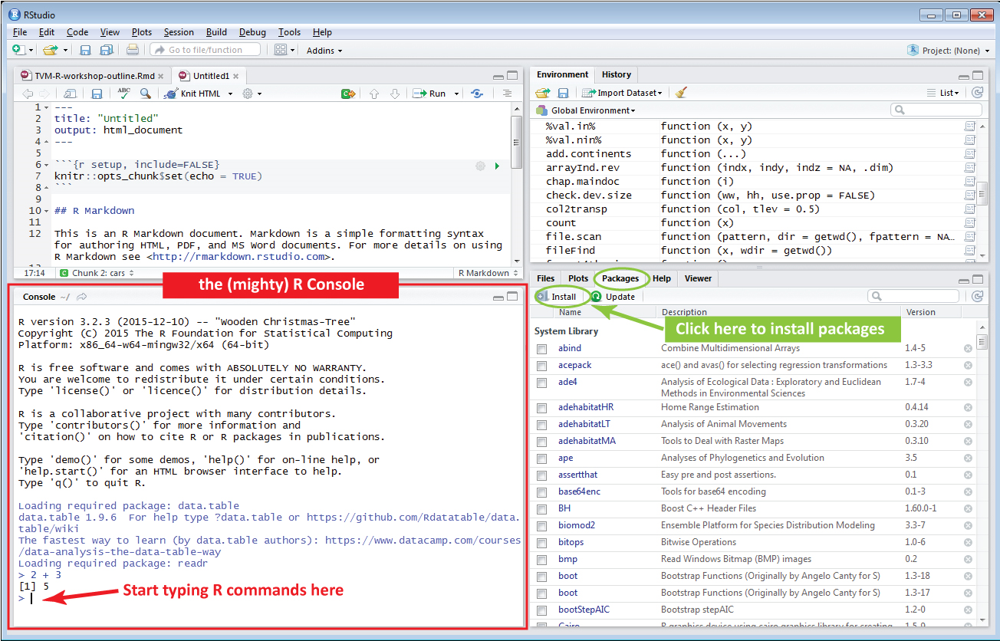
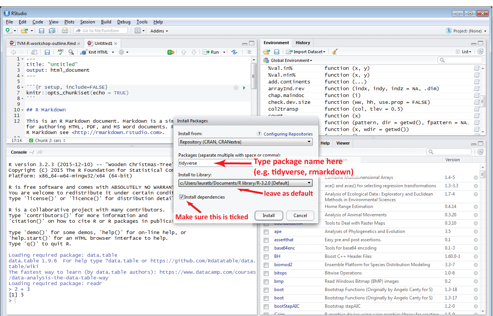

```{r setup, include=FALSE}
knitr::opts_chunk$set(echo = TRUE, cache=TRUE)
```

Packages in R (also called libraries) are shared by the R community at large and allow to expand the capabilities of the base R software by many folds. They provide a set of extra R functions around a specific theme like plotting (e.g. `ggplot2`), date manipulation (e.g. `lubridate`), statistics (e.g. `mgcv`), etc. They are great and you will learn to rely on them quickly for day-to-day tasks. You first need to install a package in R to make it available. This is very easy. 

# In R Studio 



# In the console
```{r, eval=FALSE}
install.packages('ggplot2')

```


# From the .zip 
You can find the .zip for R packages on the Comprehensive R Archive Network (CRAN). Once 

```{r, eval=FALSE}
install.packages('C:/path/to/your/package/zip/ggplot2.zip', repos=NULL, type='source')

```


# Where are my packages installed?

To see where R installs your packages, look at the first item returned by: 
```{r, eval=FALSE}
.libPaths()
```

If you want R to install packages elsewhere, you can either specify it manually by setting the argument `lib` when launching `install.packages()`, or use the R Studio install tool to pick another install location. To change it permanently, have a look [here](http://blog.revolutionanalytics.com/2015/11/r-projects.html).